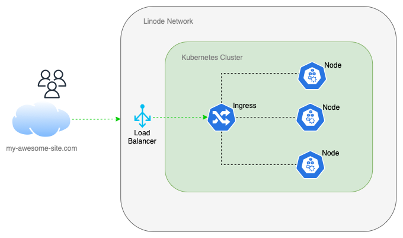

# Linode Kubernetes Engine

Kubernetes Cluster using Linode LKE and Terraform Cloud

## Architecture

* Kubernetes v1.23
* 1 Load Balancer $10.00/mo
* 3 Shared Worker nodes $30.00/month
  * Shared Worker Size: g6-standard-1 (2GB RAM, 1 CPU, 50GB Storage) $10.00/month

